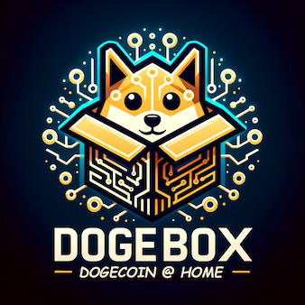

<div align="center">
  
  <p>This repository contains DogeOrg maintained pups for the Dogebox</p>
</div>

> [!CAUTION]  
> None of these pups have stable releases yet. Please only use them for testing. They may break when upgrading your Dogebox while we sort out stable interfaces.

# Pups

### [Dogecoin Core](./core/README.md)
### [Core RPC](./core-rpc/README.md)

## Configurable settings

Pups can expose end-user settings through the `config.sections` array in their manifest. Each field only needs a `name`, `label`, `type`, and an optional `default`. Supported field types:

- `text` – plain text input
- `password` – password/secret input
- `number` – numeric input (supports `min`, `max`, `step`)
- `toggle` – toggle switch
- `email` – email input with validation
- `textarea` – multi-line text input
- `select` – dropdown selection (requires `options`)
- `checkbox` – checkbox input
- `radio` – radio button group (requires `options`)
- `date` – date picker
- `range` – slider input (supports `min`, `max`, `step`)
- `color` – color picker

Example (from the Core RPC pup):

```json
"config": {
  "sections": [
    {
      "name": "rpc",
      "label": "RPC Authentication",
      "fields": [
        { "name": "RPC_USERNAME", "label": "RPC Username", "type": "text", "required": true },
        { "name": "RPC_PASSWORD", "label": "RPC Password", "type": "password", "required": true }
      ]
    }
  ]
}
```

Values are injected into the container as environment variables using the field name, making it easy for run scripts to consume them.
