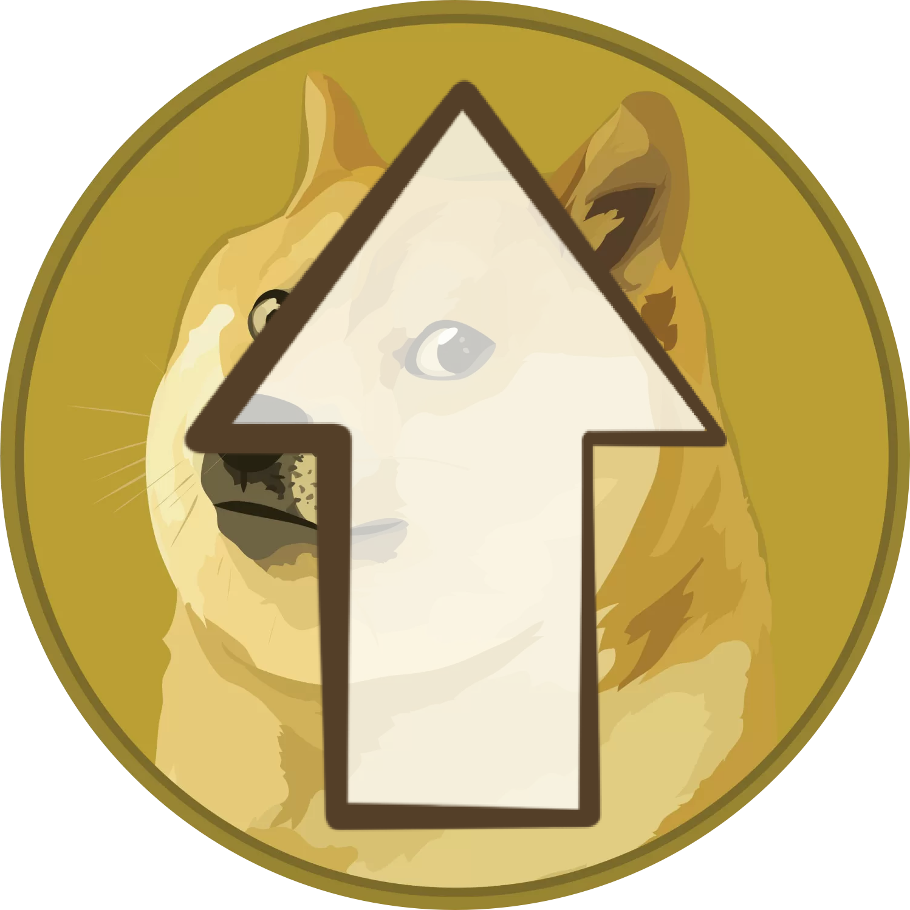

<div align="center">
  
  <p>Dogecoin Core Remote</p>
</div>

This pup connects to a remote Dogecoin Core node and exposes its RPC and ZMQ interfaces to other pups on your Dogebox.

- **Use Case**: Run pups that depend on Dogecoin Core without running Core locally.
- **Config**: Set your remote Core node's connection details.
- **Provides**: Once configured, other pups can use this as their `core-rpc` and `core-zmq` provider.

## Features

## Setup

1. Configure your remote Dogecoin Core node to allow RPC connections (see Remote Node Requirements below)
2. Install this **Dogecoin Core Remote** pup
3. Configure connection settings (host, port, credentials)
4. Link dependent pups to use this as their `core-rpc` and `core-zmq` provider

## Configuration

| Setting | Required | Description |
|---------|----------|-------------|
| Remote Host | Yes | IP address or hostname of the remote Core node |
| RPC Port | No | RPC port (default: 22555) |
| RPC Username | No | Username for RPC authentication |
| RPC Password | No | Password for RPC authentication |
| ZMQ Port | No | ZMQ port (default: 28332) |

## Remote Node Requirements

Your remote Dogecoin Core node needs these settings in `dogecoin.conf`:

```ini
server=1
rpcbind=0.0.0.0
rpcallowip=<dogebox-ip>/32
rpcuser=<your-username>
rpcpassword=<your-password>
zmqpubhashblock=tcp://0.0.0.0:28332
```

## Security Notes

- Ensure your remote Core node only allows connections from trusted IPs
- Use strong, unique RPC credentials
- Consider using Tailscale or VPN for secure remote connections
- ZMQ is read-only but exposes blockchain data in real-time
