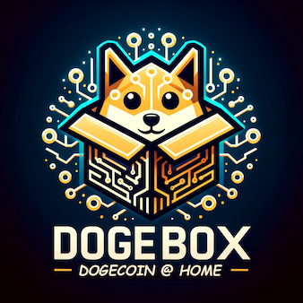

<div align="center">
  
  <p>Remote Core</p>
</div>

This pup exposes your Dogecoin Core node's RPC and ZMQ interfaces externally via a proxy pup.

- **Dependencies**: Requires a Dogecoin Core pup linked as the `core-rpc` and `core-zmq` provider.
- **Config**: Enable RPC and/or ZMQ access, optionally configure RPC authentication credentials.
- **Access**: Once running, RPC is available on port `22555` and ZMQ on port `28332` on your Dogebox host.

## Features

### Remote RPC
Expose the Dogecoin Core RPC interface with optional authentication. Allows you to make RPC calls from remote machines.

Example call from a remote machine (with authentication enabled):

```bash
curl --user "<your-username>:<your-password>" \
  -H "Content-Type: application/json" \
  --data '{"jsonrpc":"1.0","id":"test","method":"getblockcount","params":[]}' \
  http://<dogebox-host-ip>:22555/
```

### Remote ZMQ
Expose the Dogecoin Core ZMQ interface for real-time notifications (blocks, transactions). This is useful for applications that need to subscribe to blockchain events.

## Setup

1. Install the **Dogecoin Core** pup first
2. Install this **Remote Core** pup
3. Go to **Providers** and link Remote Core's dependencies to your Core pup:
   - `core-rpc` for RPC access
   - `core-zmq` for ZMQ access
4. Configure which features to enable and set RPC credentials if desired

## Configuration

| Setting | Required | Description |
|---------|----------|-------------|
| Enable Remote RPC | Yes | Enable/disable remote RPC access |
| Enable Remote ZMQ | Yes | Enable/disable remote ZMQ access |
| RPC Username | No | Username for external RPC authentication (optional) |
| RPC Password | No | Password for external RPC authentication (optional) |

**Note**: At least one of RPC or ZMQ must be enabled.

If RPC credentials are left blank, RPC access will be unauthenticated (open to anyone who can reach the port).

## Ports

| Port | Protocol | Description |
|------|----------|-------------|
| 22555 | TCP/HTTP | Dogecoin Core RPC |
| 28332 | TCP | Dogecoin Core ZMQ |

## Security Notes

- Always use strong, unique passwords for RPC access if enabling authentication
- RPC access allows control over your node - only enable if needed
- ZMQ is read-only but exposes blockchain data in real-time
- Consider using Tailscale or similar for secure remote access instead of exposing ports publicly
- Both ports are exposed on your local network by default when enabled

## Upcoming Features

- Connect to a remotely running Core node, exposing it to other pups
